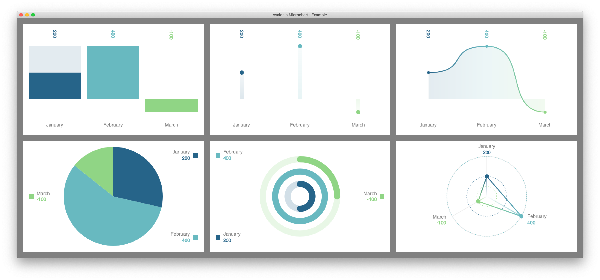

# Avalonia MicroCharts

A simple Avalonia only port of the [Microcharts](https://github.com/dotnet-ad/Microcharts) library by [Alois Deniel](http://aloisdeniel.github.io/)

**TODOs: (help wanted!)**
- Extract styling information from `src/Avalonia.Microcharts/Layout/*` to `StyledProperties` on dedicated Controls (BarChartControl, LineChartControl, ...).
- Provide (or bind to existing) values for Dark and Light themes.

**Contribute:**
Contributions are welcome! / looking for a maintainer.
